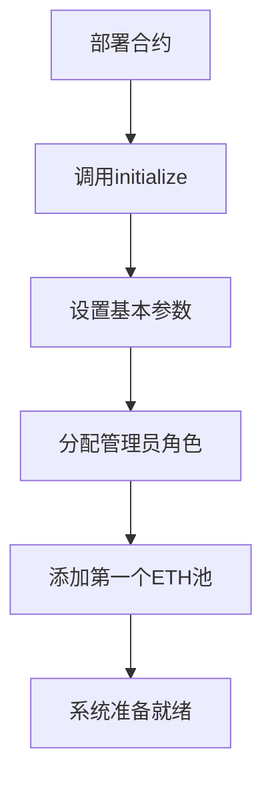
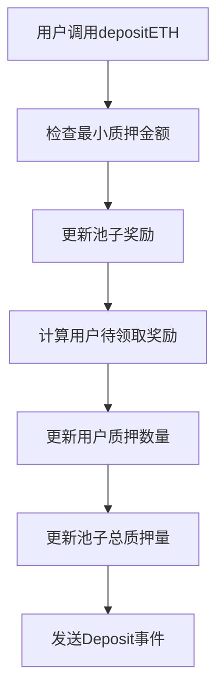
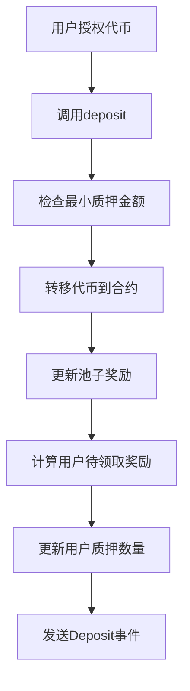
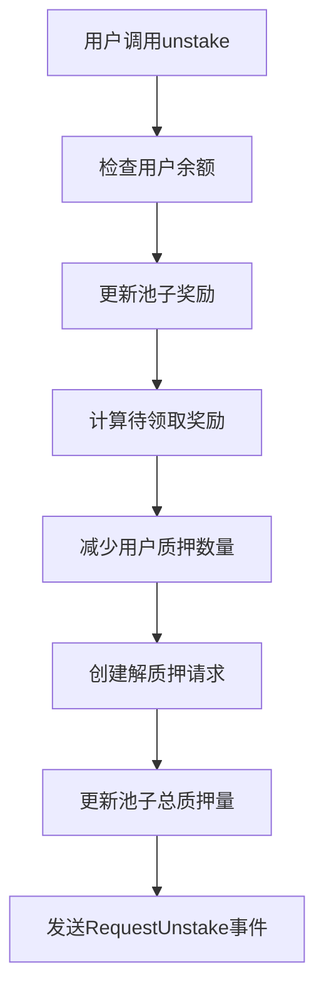
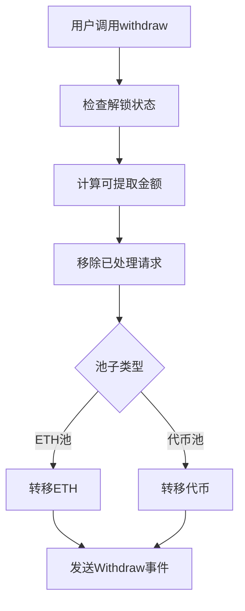
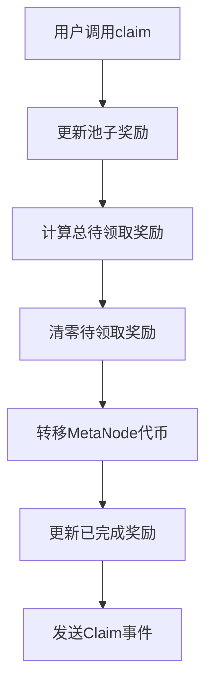

# MetaNodeStake 技术文档

## 项目概述

MetaNodeStake 是一个基于以太坊的去中心化质押奖励合约，允许用户质押多种代币（包括ETH和ERC20代币）来获得MetaNode代币奖励。该合约采用池子权重分配机制，支持多池质押、延迟提取和可升级架构。

## 核心特性

- **多池质押系统**：支持ETH和多种ERC20代币质押
- **权重分配机制**：基于池子权重分配奖励
- **延迟提取机制**：解质押后需要等待指定区块数才能提取
- **可升级架构**：采用UUPS代理模式支持合约升级
- **权限管理**：基于角色的访问控制
- **暂停机制**：管理员可暂停特定功能

## 合约架构

### 继承结构
```
MetaNodeStake
├── Initializable (初始化控制)
├── UUPSUpgradeable (可升级代理)
├── PausableUpgradeable (暂停功能)
└── AccessControlUpgradeable (权限控制)
```

### 核心组件

#### 1. 数据结构

**Pool（池子结构）**
- `stTokenAddress`: 质押代币地址（ETH为0x0）
- `poolWeight`: 池子权重，决定奖励分配比例
- `lastRewardBlock`: 最后更新奖励的区块号
- `accMetaNodePerST`: 累积每单位质押代币的奖励
- `stTokenAmount`: 池中质押代币总量
- `minDepositAmount`: 最小质押数量
- `unstakeLockedBlocks`: 解质押锁定区块数

**User（用户结构）**
- `stAmount`: 用户质押数量
- `finishedMetaNode`: 已分发奖励数量
- `pendingMetaNode`: 待领取奖励数量
- `requests`: 解质押请求数组

**UnstakeRequest（解质押请求）**
- `amount`: 解质押数量
- `unlockBlocks`: 解锁区块号

#### 2. 状态变量

- `startBlock/endBlock`: 奖励分发的开始和结束区块
- `MetaNodePerBlock`: 每区块奖励数量
- `withdrawPaused/claimPaused`: 功能暂停状态
- `MetaNode`: MetaNode代币合约实例
- `totalPoolWeight`: 所有池子权重总和
- `pool`: 池子数组
- `user`: 用户信息映射

## 核心算法与机制

### 奖励分发算法

**核心公式**
```
用户待领取奖励 = (用户质押数量 × 池子累积每单位奖励) - 用户已完成奖励 + 用户待领取奖励
```

**奖励计算流程**
1. 计算当前区块到上次更新区块的奖励总量
2. 根据池子权重分配奖励到各个池子
3. 根据用户质押比例计算用户应得奖励
4. 更新池子和用户的累积奖励状态

### 权重分配机制

```
池子奖励 = 总奖励 × (池子权重 / 总权重)
用户奖励 = 池子奖励 × (用户质押量 / 池子总质押量)
```

### 延迟提取机制

用户解质押后，资金不会立即释放，而是：
1. 创建解质押请求，记录金额和解锁区块号
2. 等待指定区块数后，用户可以提取资金
3. 提取时移除已解锁的请求

## 业务流程

### 1. 系统初始化流程



### 2. 质押流程

**ETH质押**


**ERC20代币质押**


### 3. 解质押流程



### 4. 提取流程



### 5. 奖励领取流程



## 交互接口详解

### 管理员接口

**池子管理**
- `addPool`: 添加新的质押池
- `updatePool`: 更新池子参数
- `setPoolWeight`: 调整池子权重

**系统参数**
- `setStartBlock/setEndBlock`: 设置奖励期间
- `setMetaNodePerBlock`: 调整奖励速率
- `setMetaNode`: 更新奖励代币地址

**应急控制**
- `pauseWithdraw/unpauseWithdraw`: 暂停/恢复提取功能
- `pauseClaim/unpauseClaim`: 暂停/恢复奖励领取

### 用户接口

**质押操作**
- `depositETH()`: ETH质押（payable）
- `deposit(pid, amount)`: ERC20代币质押

**解质押操作**
- `unstake(pid, amount)`: 请求解质押
- `withdraw(pid)`: 提取已解锁资金

**奖励操作**
- `claim(pid)`: 领取指定池子奖励

### 查询接口

**池子信息**
- `poolLength()`: 获取池子数量
- `pool(pid)`: 获取池子详细信息
- `getMultiplier(from, to)`: 计算区块奖励倍数

**用户信息**
- `pendingMetaNode(pid, user)`: 查询待领取奖励
- `stakingBalance(pid, user)`: 查询质押余额
- `withdrawAmount(pid, user)`: 查询可提取金额

## 安全机制

### 1. 数学安全
- 使用OpenZeppelin的SafeMath库防止溢出
- 所有乘除运算都有溢出检查
- 采用tryMul、tryDiv等安全运算函数

### 2. 权限控制
- 基于角色的访问控制（RBAC）
- 管理员角色、升级角色分离
- 关键函数都有权限检查

### 3. 状态保护
- 重入攻击防护
- 暂停机制保护
- 参数有效性检查

### 4. 资金安全
- 安全转账函数防止转账失败
- 余额检查防止超额提取
- ETH转账使用call方法并检查返回值

## 部署与配置

### 1. 合约部署步骤

```bash
# 1. 编译合约
npx hardhat compile

# 2. 部署MetaNode token
npx hardhat ignition deploy ./ignition/modules/MetaNode.js
部署之后在 terminal 拿到合约地址,比如: 0x264e0349deEeb6e8000D40213Daf18f8b3dF02c3

# 3. 部署完 MetaNode Token,拿以上地址作为 MetaNodeStake 合约的初始化参数,在 MetaNodeStake 中设置
const MetaNodeToken = "0x264e0349deEeb6e8000D40213Daf18f8b3dF02c3";

# 4. 将 stake 合约部署到 sepolia 上
npx hardhat run scripts/MetaNodeStake.js --network sepolia

# 5. 验证合约
npx hardhat verify --network sepolia CONTRACT_ADDRESS
```

### 2. 初始化配置

```javascript
// 初始化合约
await metaNodeStake.initialize(
    metaNodeToken.address,  // MetaNode代币地址
    startBlock,             // 开始区块
    endBlock,              // 结束区块
    rewardPerBlock         // 每区块奖励
);

// 添加ETH池
await metaNodeStake.addPool(
    "0x0000000000000000000000000000000000000000", // ETH地址
    1000,        // 池子权重
    ethers.utils.parseEther("0.1"), // 最小质押0.1 ETH
    28800,       // 锁定1天（按12秒一个区块计算）
    true         // 更新所有池子
);

// 添加ERC20代币池
await metaNodeStake.addPool(
    tokenAddress,           // 代币地址
    500,                   // 池子权重
    ethers.utils.parseEther("100"), // 最小质押100代币
    28800,                 // 锁定1天
    true                   // 更新所有池子
);
```

### 3. 权限配置

```javascript
// 分配管理员角色
const ADMIN_ROLE = await metaNodeStake.ADMIN_ROLE();
await metaNodeStake.grantRole(ADMIN_ROLE, adminAddress);

// 分配升级角色
const UPGRADE_ROLE = await metaNodeStake.UPGRADE_ROLE();
await metaNodeStake.grantRole(UPGRADE_ROLE, upgradeAddress);
```

## 维护与监控

### 1. 日常维护任务

**奖励分发监控**
- 监控MetaNode代币余额，确保有足够奖励可分发
- 定期调用`massUpdatePools()`更新所有池子状态
- 监控各池子的权重和奖励分配是否合理

**池子状态监控**
- 监控各池子的质押总量变化
- 关注异常质押或解质押行为
- 定期检查池子参数是否需要调整

**系统安全监控**
- 监控大额质押和解质押交易
- 关注合约权限变更事件
- 监控暂停功能的使用情况

### 2. 应急响应流程

**发现安全问题时**
1. 立即暂停相关功能（withdraw/claim）
2. 分析问题影响范围
3. 制定解决方案
4. 通知用户和社区
5. 实施修复措施

**升级合约流程**
1. 在测试网部署和测试新版本
2. 准备升级提案和文档
3. 通知社区即将升级
4. 执行合约升级
5. 验证升级结果

### 3. 性能优化

**Gas优化**
- 批量操作减少交易次数
- 优化存储变量布局
- 使用事件记录历史数据而非存储

**查询优化**
- 提供批量查询接口
- 使用视图函数减少状态读取
- 缓存常用计算结果

### 4. 监控指标

**关键指标**
- 总质押价值（TVL）
- 各池子质押分布
- 奖励发放速率
- 用户活跃度
- Gas使用效率

**告警设置**
- MetaNode余额不足告警
- 大额异常交易告警
- 合约权限变更告警
- 系统暂停事件告警

## 测试策略

### 1. 单元测试

```javascript
describe("MetaNodeStake", function() {
    it("Should handle ETH deposits correctly", async function() {
        // 测试ETH质押功能
    });
    
    it("Should calculate rewards accurately", async function() {
        // 测试奖励计算准确性
    });
    
    it("Should handle unstaking and withdrawal", async function() {
        // 测试解质押和提取流程
    });
});
```

### 2. 集成测试
- 多池子交互测试
- 大量用户并发操作测试
- 边界条件测试
- 升级功能测试

### 3. 安全测试
- 重入攻击测试
- 权限绕过测试
- 数学溢出测试
- 前端运行（front-running）测试

## 最佳实践

### 1. 开发规范
- 遵循Solidity样式指南
- 使用NatSpec文档格式
- 实施完整的测试覆盖
- 代码审计和安全检查

### 2. 部署规范
- 使用多签钱包管理关键权限
- 设置合理的时间锁延迟
- 准备应急暂停机制
- 建立监控和告警系统

### 3. 运营规范
- 定期安全评估
- 社区透明沟通
- 及时响应用户反馈
- 持续优化和改进

## 常见问题解答

**Q: 为什么解质押后不能立即提取？**
A: 延迟提取机制是为了防止恶意攻击和维护系统稳定性，给管理员时间应对突发情况。

**Q: 奖励如何计算？**
A: 奖励基于用户质押比例和池子权重分配，随着时间线性增长。

**Q: 合约可以升级吗？**
A: 是的，合约采用UUPS可升级模式，但升级需要特定权限。

**Q: 如何确保资金安全？**
A: 合约经过安全审计，使用多重安全机制，并设有应急暂停功能。