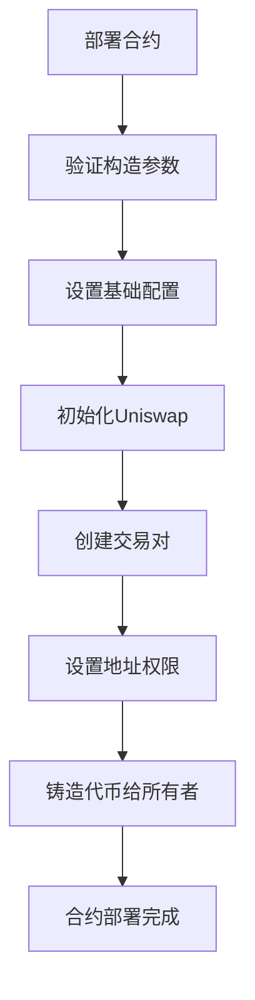
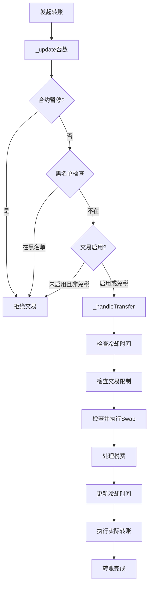
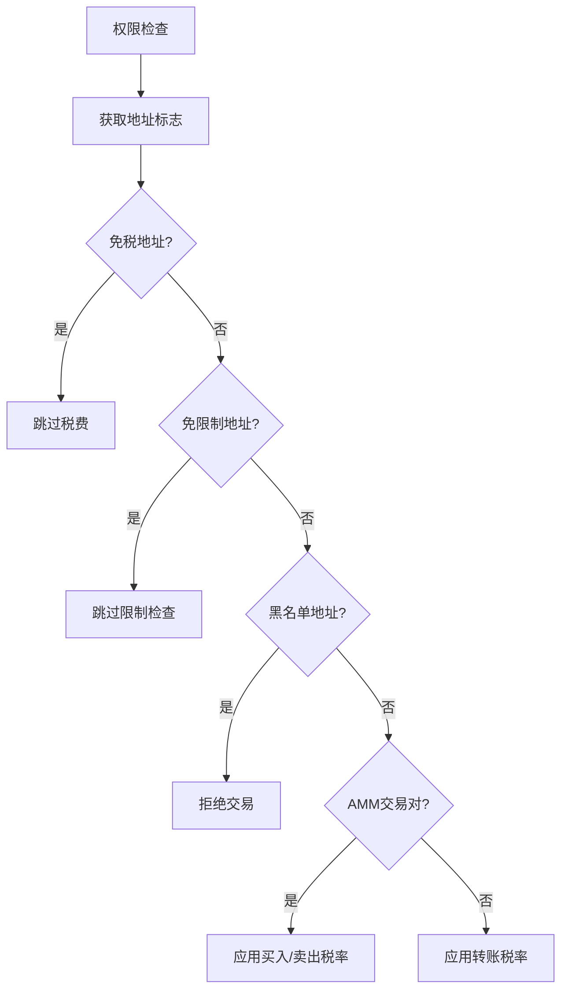
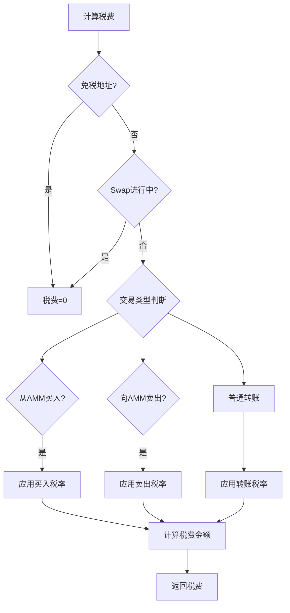
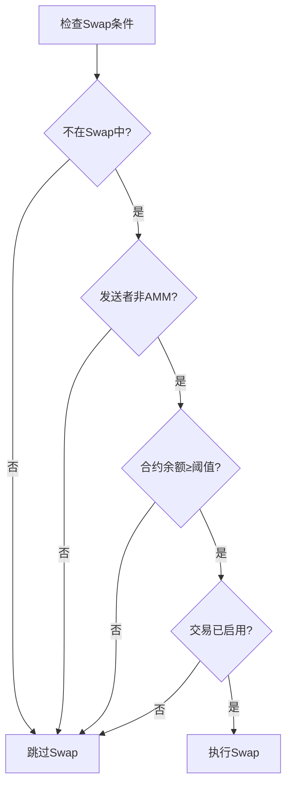
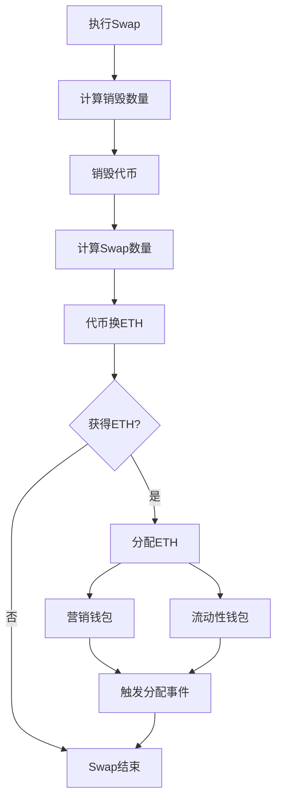
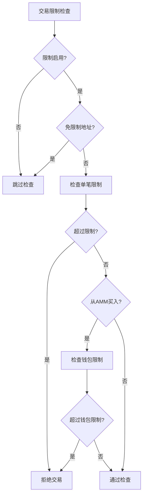

# SHIB风格Meme代币合约逻辑架构分析

## 1. 合约整体架构

### 继承关系
```
ShibStyleMemeToken
├── ERC20 (标准代币功能)
├── Ownable (所有权管理)
├── ReentrancyGuard (重入攻击保护)
└── Pausable (紧急暂停功能)
```

### 核心功能模块
1. **基础ERC20功能** - 代币转账、余额查询
2. **动态税费系统** - 买入/卖出/转账不同税率
3. **权限管理系统** - 基于位标志的高效权限控制
4. **自动Swap机制** - 税费自动转换和分配
5. **反机器人保护** - 交易限制和冷却时间
6. **管理员功能** - 参数配置和紧急控制

## 2. 数据结构设计

### 配置结构体

#### TaxRates - 税费配置
```solidity
struct TaxRates {
    uint16 buy;          // 买入税率(基点，300=3%)
    uint16 sell;         // 卖出税率(基点，500=5%)
    uint16 transfer;     // 转账税率(基点，100=1%)
}
```

#### TradingConfig - 交易配置
```solidity
struct TradingConfig {
    uint256 maxTxAmount;        // 单笔交易最大数量
    uint256 maxWalletAmount;    // 单个钱包最大持有量
    uint256 swapThreshold;      // 触发自动swap的阈值
    uint32 cooldownSeconds;     // 交易冷却时间
    bool limitsEnabled;         // 是否启用交易限制
}
```

#### FeeDistribution - 费用分配
```solidity
struct FeeDistribution {
    uint8 marketing;     // 营销费用百分比
    uint8 liquidity;     // 流动性费用百分比
    uint8 burn;          // 销毁代币百分比
    uint8 reflection;    // 持币奖励百分比
}
```

### 权限管理系统（位标志）
```
地址权限标志 (addressFlags[address] => uint8):
0x01 = 免税地址 (第0位)
0x02 = 免限制地址 (第1位)
0x04 = 黑名单地址 (第2位)
0x08 = AMM交易对 (第3位)
0x10 = 机器人标记 (第4位，扩展用)
```

## 3. 核心逻辑流程

### 合约初始化流程



**详细步骤：**
1. 验证路由、钱包地址有效性
2. 验证税率和费用分配配置
3. 设置税率、费用分配、钱包地址
4. 创建Uniswap V2交易对
5. 配置交易限制默认值
6. 设置关键地址权限标志
7. 铸造全部代币给部署者

### 转账核心流程



### 权限检查逻辑



## 4. 税费系统逻辑

### 税费计算流程



### 自动Swap触发条件



## 5. 自动Swap和分配逻辑

### Swap执行流程



### 费用分配计算
```
总ETH = Swap获得的ETH
分配份额 = 营销百分比 + 流动性百分比
营销ETH = 总ETH × (营销百分比 / 分配份额)
流动性ETH = 总ETH × (流动性百分比 / 分配份额)
```

## 6. 反机器人保护机制

### 交易限制检查



### 冷却时间机制
```
冷却检查 = 当前时间 ≥ 最后交易时间 + 冷却秒数
免限制地址跳过冷却检查
交易后更新最后交易时间
```

## 7. 管理员功能逻辑

### 参数更新流程
1. **所有者权限验证** - onlyOwner修饰符
2. **参数有效性检查** - 边界值验证
3. **更新状态变量** - 原子性操作
4. **触发更新事件** - 记录变更历史

### 紧急功能
- **暂停/恢复** - 全局交易控制
- **手动Swap** - 强制执行代币转换
- **资产救援** - 提取意外发送的资产

## 8. 安全机制总结

### 重入保护
- `ReentrancyGuard` - 防止重入攻击
- `lockSwap` 修饰符 - Swap过程锁定

### 权限控制
- `Ownable` - 所有者权限管理
- 位标志系统 - 高效权限检查
- `onlyEOA` - 限制合约调用

### 参数验证
- 税率上限检查 (≤10%)
- 地址有效性验证
- 配置一致性检查

### 状态保护
- `Pausable` - 紧急暂停
- 黑名单机制 - 恶意地址拦截
- 交易限制 - 防止操纵

## 9. 事件系统

### 关键事件类型
- **状态变更事件** - TradingEnabled, TaxRatesUpdated
- **交易执行事件** - TokensSwappedForETH, ETHDistributed
- **安全管理事件** - AddressFlagsUpdated, TokensBurned
- **紧急操作事件** - EmergencyETHWithdrawn, TokensRescued

### 事件设计原则
- 包含关键参数信息
- 使用indexed提高检索效率
- 记录重要状态变化
- 支持外部监听和分析

## 10. 优化设计亮点

### Gas优化
- **位标志系统** - 单个uint8存储多个布尔值
- **结构体打包** - 减少存储槽使用
- **批量操作** - 减少交易次数

### 用户体验
- **自动化机制** - Swap和分配无需手动触发
- **灵活配置** - 支持运行时参数调整
- **完整事件** - 支持实时状态监听

### 安全性
- **多层验证** - 参数、权限、状态检查
- **故障隔离** - Swap失败不影响正常交易
- **紧急机制** - 暂停和资产救援功能

这个合约设计体现了现代DeFi项目的复杂性和完整性，既保证了基础功能的可靠性，又提供了丰富的扩展性和管理能力。